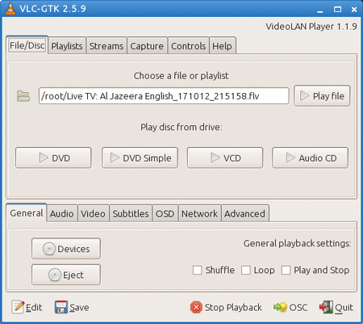
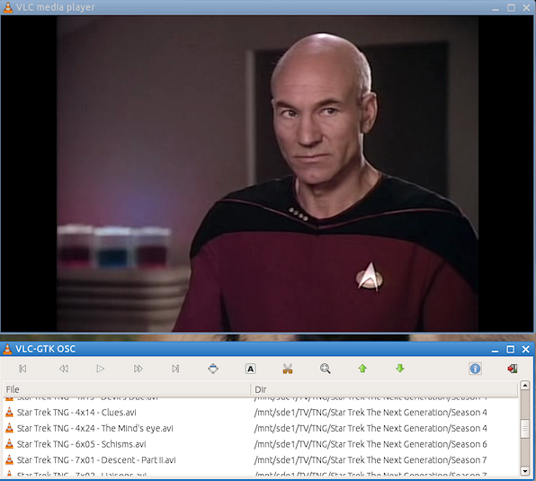

# VLC-GTK

## Description

This is a lightweight frontend GUI for [VLC](https://www.videolan.org/index.en-GB.html),
which uses [gtkdialog](https://github.com/01micko/gtkdialog/) to render the GUI,
designed for Puppy Linux.

This program is just a set of shell scripts, and contains no binaries.

If you don't have the (large) Qt-based VLC GUI, this is a tiny alternative GUI,
which you may find useful.

Only been tested on Puppy Linux. It may not work on other distros.

## Dependencies:

- gtkdialog >= 0.8.4
- vlc
- Xdialog
- xdotool
- rtmpdump (optional)
- sopcast(optional)

Note, `sopcast` and `rtmpdump` are required for some online streams.

## Screenshot

### Main menu



### During video playback



## Features:

- Supports playback and download video from youtube URLs
- Supports transcoding/converting, DVD ripping, etc
- Supports screen capture to file,
- Supports batch file conversion
- Supports multiple instances, non-root users, etc
- Open File, Dir, Playlist, DVD, VCD, Audio CD or online streams
- On-screen controls for video playback (screenshot in next post)
- Save dir as playlist (audio, video or both)
- Play and manage your favourite internet streams
- Set default playback device for CDs and DVDs
- Supports auto and file subtitles, and sub delay
- Plays online TV from CNN, FOX, MSNBC, ABC, Al Jazeera, RT News, SopCasts, more
- Change crop, aspect ratio and video output module settings
- Change the default OSD and subtitles display settings
- Store player settings and favourite streams in `$HOME/.vlc-gtk`
- Adds [ROX](https://www.linuxlinks.com/rox-filer/) right click options for VLC
- Supports the command line interface - set options before startup
- Show all commands sent to vlc in a popup window, using `--debug` (for testing)
- Type `vlc-gtk --help` in the terminal for all options

## Releases:

PET packages for Puppy Linux:

- [vlc-gtk-2.8.1](http://murga-linux.com/puppy/viewtopic.php?mode=attach&id=111858) (requires at least VLC 2.2.x)
- [vlc-gtk-2.8.0](http://murga-linux.com/puppy/viewtopic.php?mode=attach&id=70539) (requires VLC 2.1.x or older)
- [vlc-gtk-2.7.0](http://murga-linux.com/puppy/viewtopic.php?mode=attach&id=65154) (requires VLC 2.1.x or older)

Notes:

- For VLC 2.2.x and newer you must use VLC-GTK 2.8.1 or newer.
- For older VLCs, use VLC-GTK 2.8.0 or older.

## Building your own package

In Puppy Linux, run the following command from the root dir of this repo:

```shell
dir2pet vlc-gtk-2.8.1-noarch
```

This will build the PET package for you.

## Changelog

### 2.8.1:

- updated for use with VLC 2.2.x
- fixes in recording streams
- fixes in recording fave streams to file (set the codecs etc in streams tab, click rec button next to faves list)
- fixes in popup GUI for audio and streams
- font/GUI alignment fixes
- many radio streams still work.. but..
- BUG: the TV streams _all_ need updating.. don't use them, find new ones!
- BUG: recording fave streams might need to be killed in `htop` (or whatever)!

### 2.8.0:

- improved OSC: combined the Audio Playlist and on-screen GUIs into one single OSC GUI
- fixes in ordering items in playlist
- fixed resizing items in playlist GUI tree
- fixes in resize stream list in OSC for high resolutions
- fixed hide playlist GUI for radio streams
- updated resize_playback to allow for larger GUI below video
- added resize_playback to playlist GUI, if playing video
- added 'Stream Info' button next to Fave Streams list

## Contributing:

1. Fork this repo.

2. Then pull down the code:

```shell
git clone https://github.com/<username>/vlc-gtk
cd vlc-gtk
```

2. Edit some files.

3. Rebuild the PET package (see `Building your own package` above)

4. Install the package (click on it or run `petget <package>.pet`).

5. Test out your changes.

6. Share your changes:

Push your changes to your fork:

```shell
git checkout -b "mybranch"
git add .
git commit -m "some message"
git push -u origin mybranch
```

Then open a Pull Request.
